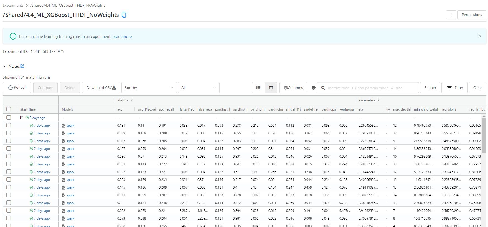
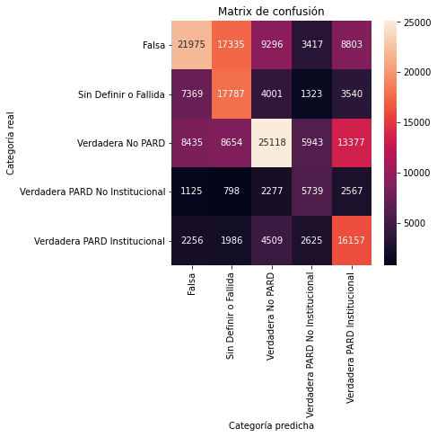

# ALGORITMOS Y ENTRENAMIENTO 

## Acerca del Modelo Triage S.R.V.D
En el marco de la Alianza Nacional contra la Violencia hacia Niñas, Niños y Adolescentes, el *Instituto Colombiano de Bienestar Familiar* (ICBF) ha trabajado en el desarrollo de modelos predictivos de vulneraciones que afectan a la niñez y adolescencia. La realización de estos modelos va en línea con el objetivo de *“Crear las condiciones para anticipar y resolver las violencias y vulneraciones contra niñas, niños y adolescentes”*, contenido en el Plan Nacional de Desarrollo 2018-2022. 

## Metodología
Con base a las información provista en las solicitudes y reportes de vulneración de derechos presentadas al ICBF por los distintos canales, el modelo desarrollado de aprendizaje de máquinas *(machine learning)* permite predecir con cierto nivel de confianza cuál será el resultado de la solicitud: si esta será clasificada como una solicitud Verdadera (en el sentido que en verdad reporta una situación de vulneración de derechos que debe ser priorizada) o si se clasificará como una solicitud Sin Definir, Fallida o Falsa (que por falta de información suficiente no podrá ser verificada o que al momento de ser verificada en verdad no involucraba una situación de vulneración de derechos). Usando este modelo es posible realizar una Traige de todas las solicitudes que ingresan al ICBF diariamente y así priorizar para la verificación y acompañamiento aquellas que denoten mayor gravedad.

Para lograr dicho resultado el proyecto involucra 5 etapas: gestión de los datos, Procesamiento de Lenguaje Natural (PLN, o NLP por sus siglas en inglés) de la descripción que contiene cada solicitud, entrenamiento de modelos de *Machine Learning*, evaluación de los distintos modelos entrenados y predicción/clasificación de nuevas solicitudes que ingresan diaramente al ICBF.

## 1. Gestión de los datos: 

Esta etapa contiene distintos pasos que permiten tener una base de datos unificada para el entrenamiento de modelos de *Machine Learning* con 31 variables obtenidas a partir de la información que contiene la solicitud, entre 100 y 300 variables obtenidas a partir del Procesamiento de Lenguaje Natural (dependiendo del método empleado) y 1.163.243 solicitudes o reportes de vulneración de derechos presentadas al ICBF entre enero de 2015 y mayo de 2021. 

### 1.1. Cruce distintas fuentes de información

La fuente de datos principal es la base de Solicitudes de Restablecimiento de Derechos (SRD) y de Reportes de Amenaza o Vulneración de Derechos (RAVD) registrada por la Dirección de Servicios y Atención del ICBF entre enero de 2015 y mayo de 2021. Esta fuente registra información sobre cada solicitud o reporte (fecha y hora de registro, tipo de vulneración de derechos reportada, canal de recepción de la solicitud y centro zonal al que se direcciona), información del peticionario que la presenta (edad, sexo, tipo de documento de identidad) y del afectado al que posiblemente se le están vulnerando sus derechos (edad, sexo, tipo de documento de identidad, país de residencia, grupo étnico, si presenta alguna discapacidad o si es víctima de desplazamiento).

Esta información se cruza con las bases de Ingresos a Proceso Administrativo de Restablecimiento de Derechos (PARD) de la Subdirección de Restablecimiento de Derechos. Este cruce es fundamental para conocer cuál fue el resultado de las distintas solicitudes y reportes y así contruir la variable objetivo del modelo. Adicionalmente se realizan dos cruces para recuperar variables que puedan tener un alto poder predictivo en el modelo: las coordenadas de los centro zonales a los que se direcciona cada solicitud y 7 variables de la regional correspondiente al centro zonal (porcentajes de población étnica, indígena y rural obtenidas del Censo Nacional de Población y Vivienda del 2018 realizado por el DANE, las tasas de violencia intrafamiliar e interpersonal por cada 100.000 habitantes del Instituto Nacional de Medicina Legal, la tasa de víctimas de delitos sexuales por cada 100.000 habitantes obtenidas del SPOA de la Fiscalía General de la Nación y la tasa de fecundidad específica por cada 1.000 mujeres entre 15 y 19 años de Estadísticas Vítales del DANE).

En    [`Procesados`](Procesados) se encuentra el script respectivo para estos cruces:
   
* ``1_Importacion y cruce.ipynb``   

### 1.2. Limpieza y creación de variables

En el paso anterior se obtuvo una base de datos unificada, pero es necesario comprobar que las variables y registros obtenidos previamente sean consistentes, sin duplicados o datos inválidos, ara lo cual se realiza un proceso de limpieza y homologación de categorías.  y la creación de la variable objetivo.

A partir del conocimiento de la problemática y la información disponible en las bases de datos utilizadas se crearon dos nuevas variables *(feature engineering)* que tienen potencial poder predictivo: una categorización del peticionario en el que mediante los nombres y apellidos registrados se identifica si el peticionario es el mismo afectado, si comparte apellidos con el afectado y por lo tanto puede ser un familiar, si es un anónimo, o si hace parte de una institución como la Policía, la Fiscalía, un centro de salud, una entidad judicial, una institución educativa, el Ministerio Público, de una ONG o del ICBF; también se crea una variable indicativa que permite identificar si existe suficiente información para adelantar la verificación de la solicitud, es decir, que cuente por lo menos con los nombres del afectado y una dirección específica.

También se realizó la creación de la variable objetivo, esto es, la categoría en la que se clasifica el resultado de cada solicitud luego de la verificación y que también tiene implícito un orden de urgencia para darle prioridad. La variable objetivo cuenta con 5 categorías: Falsa, Sin Definir o Fallida, Verdadera no PARD, Verdadera PARD no Institucional y Verdadera PARD Institucional.
* Una solicitud se clasifica como falsa cuando luego de la constatación o verificación por el equipo de Defensoría de Familia se encuentra que en la situación reportada no existe una vulneración de derechos
* La categoría "Sin Definir o Fallida" se aplica a los reportes que no pudieron constatarse porque los datos de ubicación no fueron entregados o son errados
* La clasificación de Verdadera no PARD es para aquellas solicitudes que luego de la verificación se encontró que efectivamente existe una vulneración de derechos pero no revestía la gravedad para la apertura de un PARD sino un acompañamiento mediante el Sistema Nacional de Bienestar Familiar
* Para los reportes clasificados como Verdadera PARD se verificó la vulneración de derechos y se hizo apertura de un PARD, pero varían en la medida tomada para el restablecimiento de los derechos, si se tomaba una medida Institucional en la que se ubica al menor por fuera de su hogar o no.

En la carpeta [`Procesados`](Procesados) se encuentra el script para esta limpieza y creación de nuevas variables:
   
* ``2_Limpieza y creacion de variables.ipynb``   

## 2. Procesamiento de Lenguaje Natural (PLN)

Una fuente de información muy importante para conocer la situación reportada es la que se encuentra en el campo DescripcionPeticion. Sin embargo esta es una información no estructurada, es decir, no tiene un formato, longitud o categorías definidas, sino que contiene texto escrito en español tal como lo digita la persona que recibe la solicitud. Debido a esto, requiere un procesamiento especial para poder capturar la riqueza de la información allí contenida e ingresar en un formato admitido por los modelos de *Machine Learning*, lo que se conoce como Procesamiento de Lenguaje Natural (PLN, o NLP por sus siglas en inglés).

Para el presente proyecto se probaron 3 métodos para este procesamiento: Texto a secuencias, en el que se asigna un número a cada palabra de la descripción, asignándole un número menos a las palabras más frecuentes y un número mayor a las palabras menos frecuentes (para más información consultar [esta página](https://www.tensorflow.org/api_docs/python/tf/keras/preprocessing/text/Tokenizer)); *TF-IDF*, en el que las palabras son convertidas a números de acuerdo a su frecuencia de aparición en una descripción particular y en el corpus total de las denuncias (para más información consultar [esta página](https://spark.apache.org/docs/latest/mllib-feature-extraction.html#tf-idf)); y *Word Embeddings* con el modelo pre-entrenado GloVe (para más información consultar [esta página](https://nlp.stanford.edu/projects/glove/)).

En [`Procesados`](Procesados) se encuentra el script para el preprocesamiento del texto de la descripción:
   
* ``3_PipelineSpark_TFIDF_Embedding.ipynb``  
* ``4.1_ML_RedesNeuronales.ipynb``   

## 3. Entrenamiento de modelos de *Machine Learning*

Luego de realizar la limpieza y preprocesamiento de los datos se procede a la etapa de entrenamiento de modelos. Dos grupos de algoritmos o modelos de *Machine Learning* son entrenados para la tarea de clasificación de las solicitudes y reportes: Árboles de decisión con potenciación del gradiente (*Gradient Boosted Trees*) mediante la librería de XGBoost y Redes neuronales con la librería de Tensorflow Keras.

Sin importar el algoritmo, para el entrenamiento y evaluación de los modelos solo se emplearon las solicitudes registradas entre enero de 2005 y mayo de 2020. Esto corte tiene en cuenta que la apertura de un PARD puede tomar cierto tiempo, por lo que las solicitudes entre junio de 2020 y mayo 2021 pueden no haber cumplido todo el proceso requerido y no tener una clasificación final en la variable objetivo. Luego de este filtro se tienen 982.085 registros, de los cuales el 80% (785.668) se emplean para el entrenamiento y 20% (196.417) para evaluación.

### 3.1. Modelos de redes neuronales

Se entrenaron 5 modelos diferentes de redes neuronales, todos los cuales utilizaban como preprocesamiento de la descripción de la petición el texto a secuencias. 

**Incluir aquí descripción de modelos de redes neuronales**.  

En la carpeta [`Procesados`](Procesados) se encuentra el script empleado para el entrenamiento de las redes neuronales:

* ``4.1_ML_RedesNeuronales.ipynb``

### 3.2. Modelos de *Gradient Boosted Trees*

Se entrenaron tres tipos de *Gradient Boosted Trees*, que variaban en el método de preprocesamiento la descripción de la petición y el uso de pesos diferenciados para contemplar el desbalance existente entre las distintas categorías de la variable objetivo. 
* En el primer tipo, que se entrena en el script ``4.2_ML_XGBoost_Embedding_Weights.ipynb``, se emplean las variables resultantes del preprocesamiento de texto con *Word Embeddings* y pesos diferenciados para cada observación, esto último para que el modelo tenga en cuenta que también es importante clasificar las solicitudes "Verdaderas PARD Institucional" a pesar de que representan solo el 6,4% de los registros y no se ocupe solamente de clasificar correctamente la categoría mayoritaria (que en este caso es "Verdadera no PARD" con 31,4% de los registros).
* El segundo tipo de modelos, representado en el script ``4.3_ML_XGBoost_TFIDF_Weights.ipynb``, emplea igualmente los pesos diferenciados pero utiliza el método *TD-IDF* de Procesamiento de Lenguaje Natural.
* Finalmente, el tercer tipo de modelos, entrenados en el script ``4.4_ML_XGBoost_TFIDF_NoWeights.ipynb``, emplea igualmente las variables obtenidas luego de aplicar *TF-IDF* a la descripción de la petición, pero en cambio da pesos iguales a todas las observaciones sin importar la categoría de la variable objetivo en la que se encuentren.

En estos modelos de árboles de decisión también se hizo búsqueda de los mejores hiperparámetros (*hyperparameter tuning* o *grid search* como se conoce en inglés) mediante la librería HyperOpt, por lo que para cada uno de estos tres tipos de modelo se entrenaron 50 iteraciones con distintos combinaciones de hiperparámetros, lo que resulta en un total de 150 modelos entrenados de *Gradient Boosted Trees*

## 4. Evaluación de resultados de los modelos y selección del mejor modelo

Para la etapa de evaluación de los distintos modelos fue fundamental la librería MLflow, que mediante su integración con Databricks permite guardar los hiperparámetros empleados en cada entrenamiento, registrar los modelos para su fácil puesta en producción e igualmente registrar las métricas en un tablero que facilita su comparación entre los diferentes modelos. La imagen a continuación muestra el tablero de MLflow en el que se pueden ver los distintos modelos entrenados con sus respectivas métricas e hiperparámetros.

En general se encontró que con los algoritmos y métodos implementados realizar una clasificación acertada entre las 5 categorías de la variable objetivo es una tarea difícil. Todos los modelos tuvieron un *Accuracy* (Exactitud) no superior a 46,7% y un *Average Recall* (Exhaustividad Promedio) no superior a 46,8%.

Tras analizar detalladamente la razón de este relativamente bajo desempeño de los distintos modelos, se encontró que suele confundir la clasificación entre el grupo de  solicitudes Verdaderas (aquellas con las categorías "Verdadera no PARD", "Verdadera PARD no Institucional" y "Verdadera PARD Institucional") o entre el grupo de Fallidas o Falsas (aquellas con las categorías "Falsa" o "Sin Definir o Fallida"). Sin embargo, si se agrupan las 5 categorías iniciales en estas dos categorías de Verdaderas y Falsas o Fallidas se encuentra que el desempeño de los modelos entrenados es bueno, llegando a un *Accuracy* de hasta 72,7% y un *Recall* de 77,1%. Esto se puede ilustrar mediante la matriz de confusión del modelo elegido.

  

## 5. Triage/Clasificación de nuevas solicitudes

