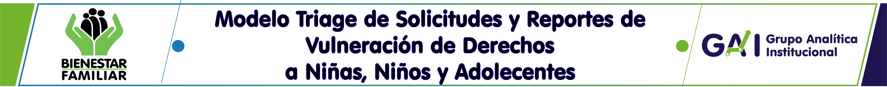

# ALGORITMOS Y ENTRENAMIENTO 

## Acerca del Modelo Triage S.R.V.D
En el marco de la Alianza Nacional contra la Violencia hacia Niñas, Niños y Adolescentes, el *Instituto Colombiano de Bienestar Familiar* (ICBF) ha trabajado en el desarrollo de modelos predictivos de vulneraciones que afectan a la niñez y adolescencia. La realización de estos modelos va en línea con el objetivo de *“Crear las condiciones para anticipar y resolver las violencias y vulneraciones contra niñas, niños y adolescentes”*, contenido en el Plan Nacional de Desarrollo 2018-2022. 

## Metodología
Con base a las características de las denuncias realizadas en los distintos canales, los modelos desarrollados de aprendizaje de máquinas *(machine learning)* permiten predecir la probabilidad o riesgo de que se presente una vulneración de derechos. Usando esto, es posible generar algoritmos que organizen dichas denuncias a fin de que estas puedan ser visualizadas y atendidas por el personal del ICBF mediante el artefacto o visualización a realizar acorde a los objetivos planteados.

Previamente desde G.A.I *(Grupo de Analítica institucional)* se habían realizado versiones del modelo probabilístico, las cuales habían sido difundidas en instancias internas y externas al ICBF. Gracias a ello, al momento de iniciar esta versión del modelo se contaba con un conocimiento acumulado de la problemática y con la retroalimentación para poder realizar los siguientes pasos: 

## 1. Gestión de los datos: 

Esta etapa contiene distintos pasos que permiten tener una base de datos unificada para poder realizar procesos de predicción con xxxx variables y cerca de xxxxxx de las denuncias realizadas en los distintos canales del ICBF de niños, niñas y adolescentes. 

### 1.1 Importación y Cruce 

Se parte de cruzar la base principal de peticiones de vulneración y restablecimiento de derechos con las bases de PARD, con un archivo de Reportes de Amenaza o Vulneración -RAVD- que contiene algunas variables importantes que no están en la base de peticiones y con la base resultante del modelo probabilisto de vulneración de derechos (que parte de registros del Sisbén IV). 

En    [`Procesados`](Procesados) se encuentra el script respectivo:
   
* ``Importación y cruce.ipynb``   

### 1.2 Limpieza

En el paso anterior se obtuvo una base de datos unificada pero es necesario comprobar que los cruces realizados previamente sean consistentes, evitando repeticiones, datos invalidos y quede una base consolidada de peticiones con los campos necesarios para obtener la variable objetivo. 

Ver script en [`Procesados`](Procesados):
   
* ``Limpieza_denuncias.ipynb``   

## 2. Predicción

### 2.1 Testeo

### 2.2 Entrenamiento 

## 3. Evaluación

## 4. Modelación

