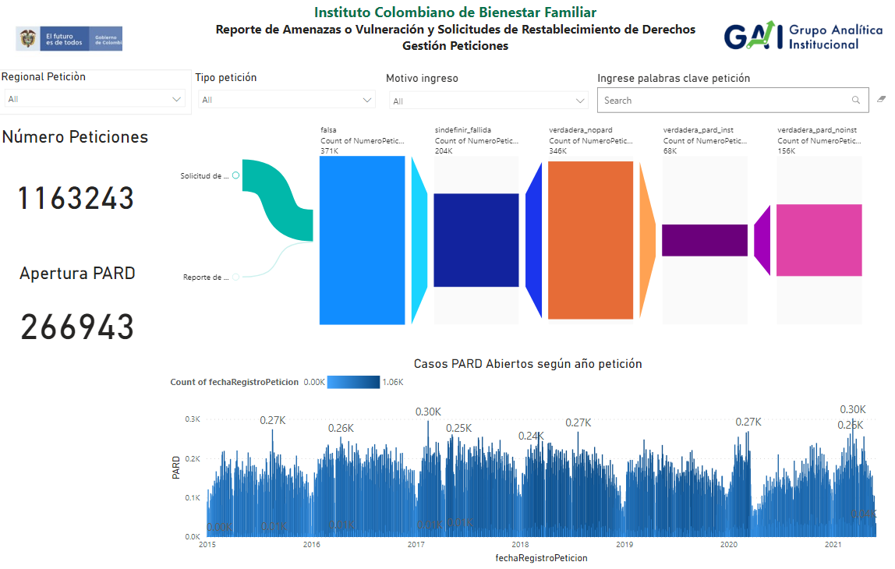
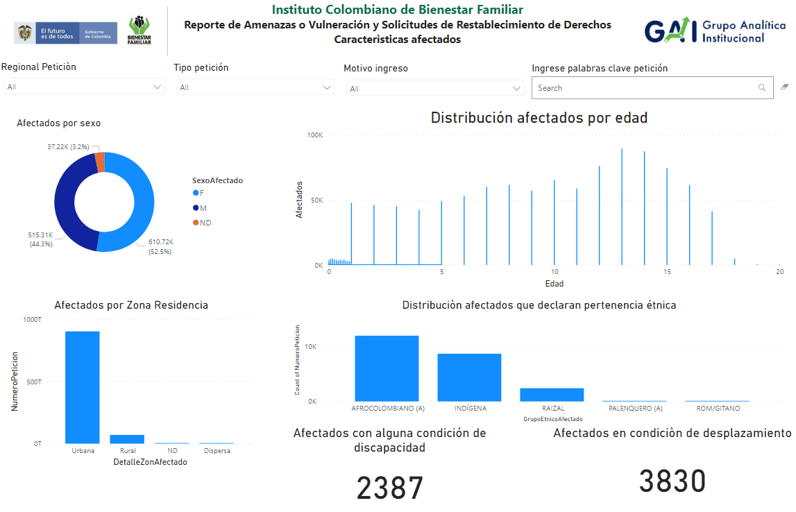

# ARTEFACTO O VISUALIZACIÓN

## Power BI

 Para las distintas instancias del **ICBF** será de gran apoyo para priorizar las denuncias realizadas desde los distintos canales relacionadas con los niños, niñas y adolescentes en el territorio colombiano, mediante informes generados por medio de ***Power BI***  usando los datos previamente entrenados y evaluados de las denuncias realizadas en los distintos canales.  

A continuación algunas de las visualizaciones o tableros generados. 
# Reporte de amenazas o vulneración y solicitudes de restablecimiento de derechos 
* # Características.

* # Gestión Peticiones.

* # Caracteristicas Afectados.

# Tablero para Defensores de Familia.

* ## Priorización de Solicitudes de Restabblecimiento de Derechos y Reportes de Amenaza o Vulneración.

