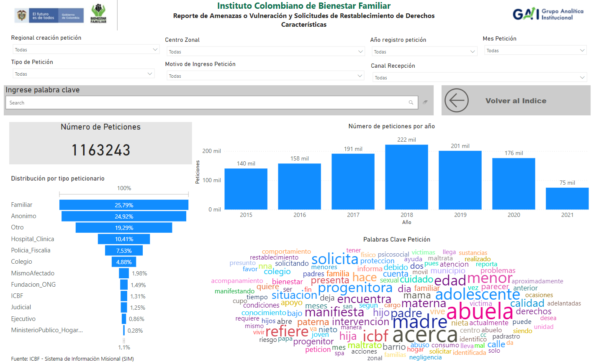
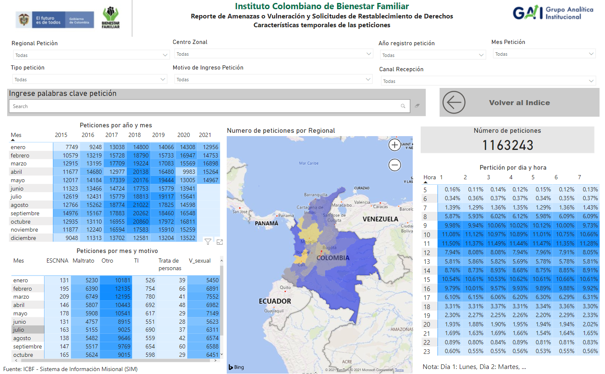
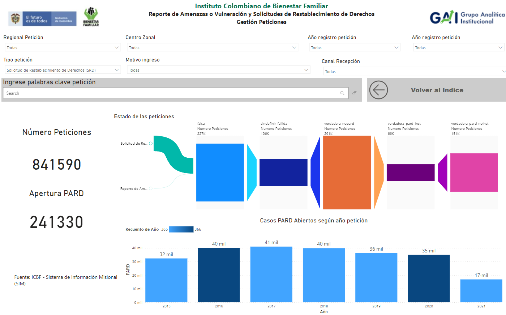
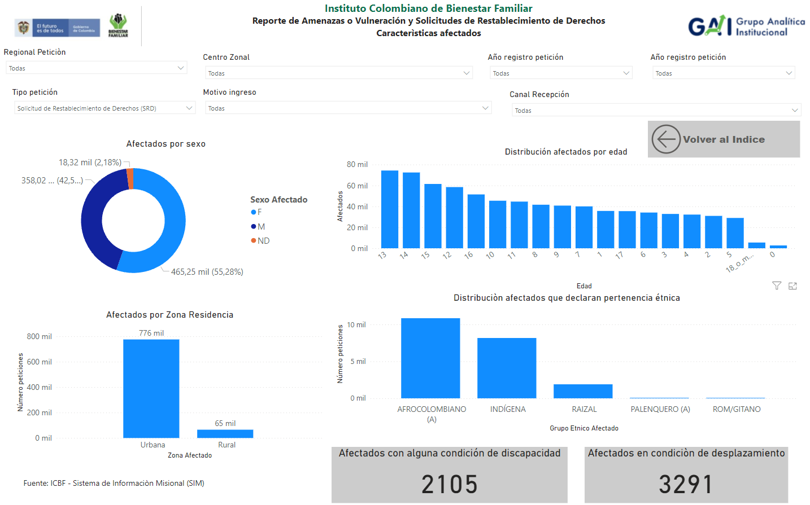
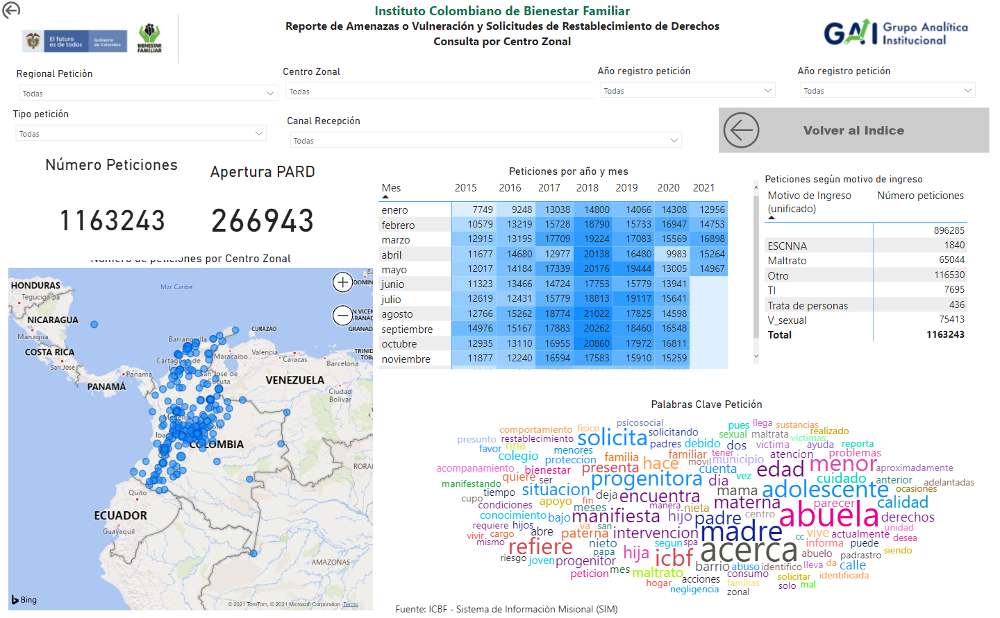
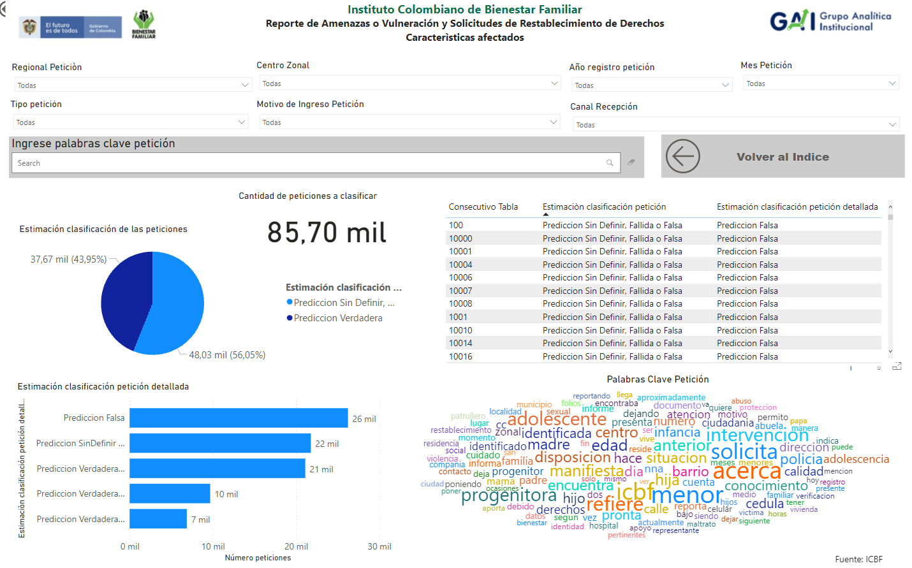

# Visualización

Como producto final del proyecto, se desarrolló una tablero de visualización en ***Power Bi*** que permite explorar todas las solicitudes de restablecimiento y reportes de vulneración de derechos a niñas, niños y adolescentes presentadas al ICBF entre enero de 2015 y mayo de 2021. Igualmente, muestra los resultados del modelo de *Machine Learning* entrenado para poder clasificar estas peticiones de acuerdo a su veracidad y gravedad, lo cual se pleantea como una importante herramienta para los equipos de Defensoría de Familia en busca de priorizar la constatación y verificación de las situaciones reportadas.

Este tablero se puede consultar [en este enlace](https://app.powerbi.com/view?r=eyJrIjoiOTUxMjRkYzItOGJlNy00OGY0LThjYjUtYWI3YmQ2YzA1YmM4IiwidCI6IjNkOTJhNWYzLWJjN2EtNGE3OS04YzVlLTVlNDgzZjc3ODliZiIsImMiOjR9) o haciendo clic en la siguiente imagen.

A continuación se hace una breve descipción de cada una de las pantallas disponibles en el tablero.

* [Descripción general de las peticiones](#Descripción-general-de-las-peticiones)
* [Análisis por regional y tiempo (año, mes día y hora)](#Análisis-por-regional-y-tiempo)
* [Estado de las peticiones](#Estado-de-las-peticiones)
* [Caracterización de niños, niñas y adolescentes afectados](#Caracterización-de-niños-niñas-y-adolescentes-afectados)
* [Análisis por centro zonal](#Análisis-por-centro-zonal)
* [Triage de solicitudes de restablecimiento y reportes de vulneración de derechos](#Triage-de-solicitudes-de-restablecimiento-y-reportes-de-vulneración-de-derechos)

## Descripción general de las peticiones

## Análisis por regional y tiempo

## Estado de las peticiones

## Caracterización de niños, niñas y adolescentes afectados

## Análisis por centro zonal

## Triage de solicitudes de restablecimiento y reportes de vulneración de derechos

