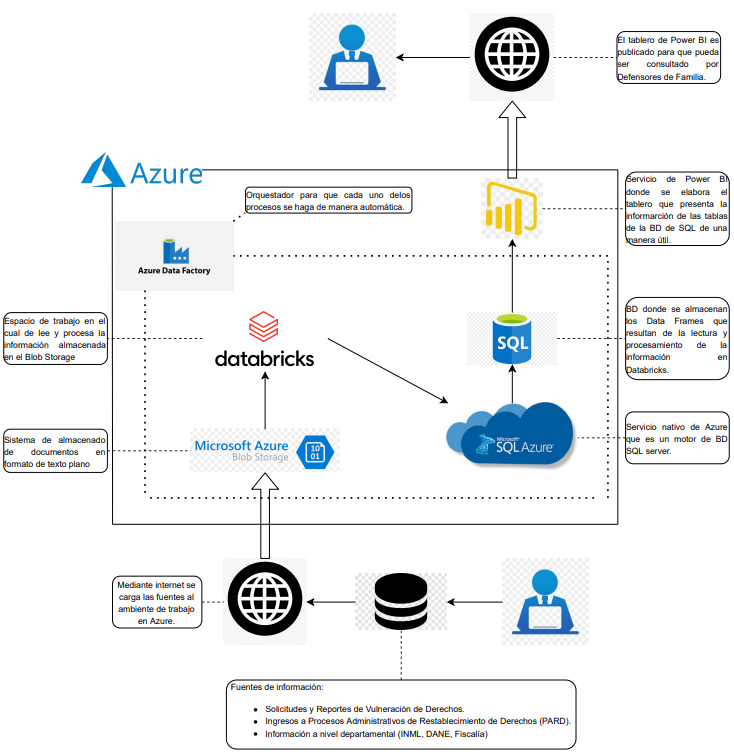

# Modelo
Realizar procesamiento de lenguaje natural (NLP) sobre los textos e interacciones en chat de denuncias de vulneración de derechos de niños, niñas y adolescentes realizadas a través de los canales del ICBF, con el propósito de diseñar artefactos de priorización de verificaciones en campo u otras herramientas similares como artefactos de reacción inmediata, chatbots, etc.

## Descripción

Anualmente el *Instituto Colombiano de Bienestar Familiar* **(ICBF)** recibe alrededor de **120 mil** denuncias asociadas a vulneraciones de derechos de niños, niñas y adolescentes, debido a esto usa gran parte de sus recursos en la verificación y constatación en campo de las mismas. Sin embargo, algunas de estas requieren ser priorizadas para minimizar el riesgo individual y familiar. 

Pensando en esto, el *Grupo de Analítica Institucional* (GAI) del ICBF emprendió este proyecto para diseñar mecanismos que permitan automatizar la clasificación de riesgo de las denuncias y comprender el contexto en el que ocurren, a través del análisis sistemático de las descripciones de las denuncias mediante las técnicas de procesamiento de lenguaje natural. Este proyecto permitirá que el ICBF pueda pilotear mecanismos más eficientes de distribución de los recursos para la verificación en campo y constatación de las denuncias de vulneración de los niños, niñas y adolescentes del país.

## Objetivo general

* Diseñar artefactos de priorización de verificaciones en campo u otras herramientas similares como artefactos de reacción inmediata, chatbots, etc, con base en el procesamiento de lenguaje natural (NLP) sobre los textos e interacciones en chat de denuncias de vulneración de derechos de niños, niñas y adolescentes realizadas a través de los canales del ICBF.

### Objetivos Especificos

* Realizar un análisis contextual de las denuncias de acuerdo con los tipos de violencias o vulneraciones de derechos de los que son víctimas los niños, niñas y adolescentes, mediante procesamiento de lenguaje natural de las descripciones de las denuncias que recibe el ICBF.

* Identificar variables y factores que permitan realizar predicción y etiquetado de las denuncias de acuerdo con su posible veracidad y gravedad.

* Diseñar un prototipo de artefacto que permita a los equipos del ICBF consultar los niveles de prioridad (pronosticados por el modelo) en la verificación y constatación en campo de las denuncias que reciben.

## Tabla de contenidos

* [Descripción](#Descripción)
* [Objetivos](#Objetivo-general)
* [Tecnologías involucradas](#Tecnologíasinvolucradas)
* [Datos](#Datos)
* [Algoritmos y Entrenamiento](#AlgoritmosyEntrenamiento)
* [Artefacto o Visualización](#ArtefactoVis)
* [Diccionario](#Diccionario)

## Tecnologías involucradas

## Datos 
Se encuentran dos bases de datos principales (ubicadas en [`Datos-Ejemplo/Para-Modelo`](Datos-Ejemplo/Para-Modelo)):

* ``dscrga_json.csv``  
Esta base cuenta con 5968 registros de tweets en los periodos 2018-II, 2019 y 2020-I, sobre las que se establecieron tres criterios de búsqueda en los objetos tweets. Estos criterios se basan en las palabras “DANE, empleo o desempleo”. 
Los datos fueron descargados mediante el paquete de [jsonlite](https://cran.r-project.org/web/packages/jsonlite/jsonlite.pdf) de RStudio. Este se ejecuta mediante un código que simula una búsqueda de términos en la página de Twitter con los criterios establecidos.

* ``Senti_Tweet_all_variables.xlsx``  
Esta base consta de 23975 registros entre las fechas 01 de octubre de 2020 y 17 de diciembre de 2020 utilizando la etiqueta de búsqueda “DANE_Colombia”.
Los objetos de esta base fueron descargados mediante el servicio de [Logic Apps](https://azure.microsoft.com/es-es/services/logic-apps/) de Microsoft Azure mediante la conexión a la API de twitter y marcados en tiempo real mediante el servicio de [Text Analytics](https://azure.microsoft.com/es-es/services/cognitive-services/text-analytics/) el cual es un componente de detección del sentimiento que marca la polaridad (positivo, negativo, neutro) de los textos (tweets).

## Algoritmos y Entrenamiento

En la ubicación [`AlgoritmosyEntrenamiento/Para-Modelo`](App/Despliegue) se encuentra tanto el Notebook ``p_to_dasboard_twitter.ipynb`` como el modelo de dashboard ``p_to_dasboard_twitter.html`` desarrollados para este ejercicio exploratorio con información referente al conjunto de datos ``Senti_Tweet_all_variables.xlsx``.

####  I. Diccionario

Se incluye el diccionario en la carpeta [`Datos/DiccionarioDatos`](Datos/DiccionarioDatos)

* ``diccionariodenuncias.xlsx``  
Este diccionario contiene todas las variables usadas en los dataframe unidos.

#### II. Modelo entidad relación 

## Artefacto o Visualización

#### Agregar vistas y link de powerbyi

