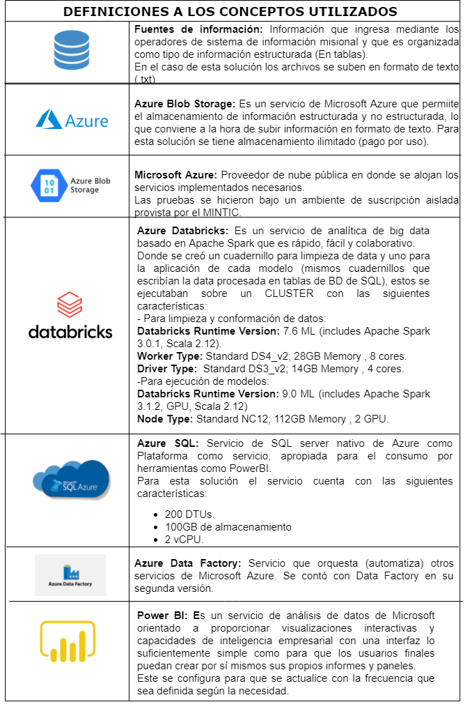

## Descripción
Mediante el programa de [`Data Sandbox`](https://sandbox.datos.gov.co/#!/inicio) del Ministerio de Tecnologías de la Información y las Comunicaciones de Colombia (MinTIC) el ICBF tuvo acceso a los servicios en la nube de Microsoft Azure para experimentar y desarrollar el proyecto. A continuación se presenta una descripción de los servicios utilizados.

## Diagrama de Arquitectura

El siguianta diagrama de arquitectura relaciona los servicios utilizados con las etapas adelantadas para alcanzar el objetivo del proyecto.

